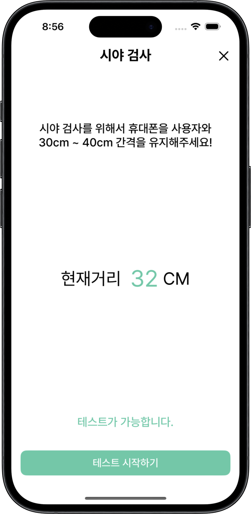
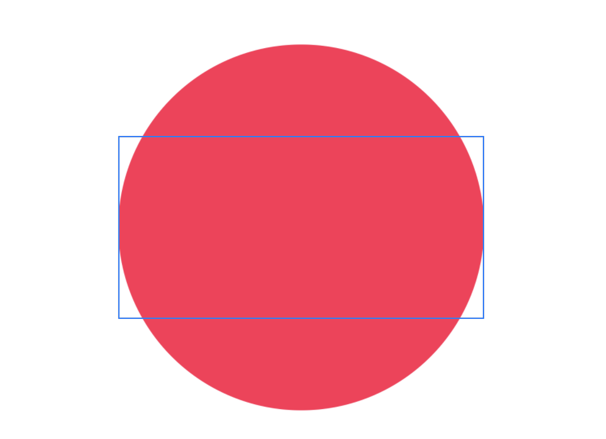
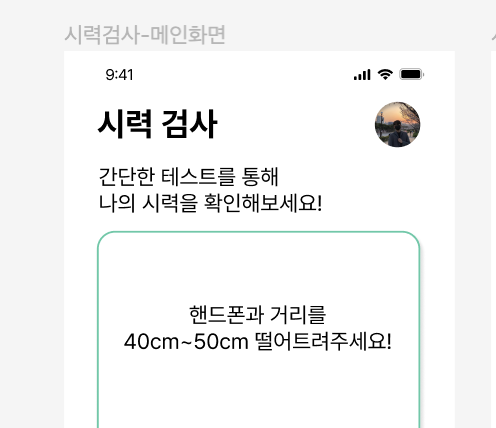
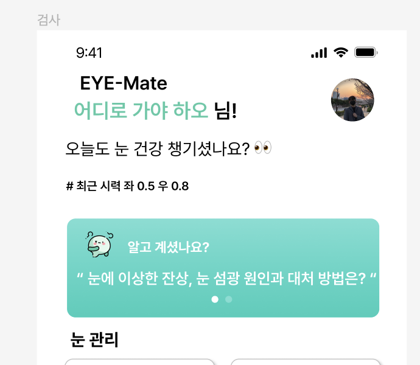

# EYE-Mate

<p align="center">

</p>

### 🗂️ 목차
1. [앱 소개](#앱-소개)
2. [개발 환경](#개발-환경)
   - [프로젝트 아키텍처](#프로젝트-아키텍처)
   - [사용한 기술](#사용한-기술)
   - [사용한 라이브러리](#사용한-라이브러리)
3. [트러블 슈팅](#트러블-슈팅)
4. [팀원 소개](#팀원-소개)

</br>

## 📝 앱 소개

### 내 눈을 지켜주는 친구, EYE-Mate

> **EYE-Mate는 눈 건강 관리 및 커뮤니티 플랫폼입니다.**</br></br>
>
> ❓현대인들의 눈에 대한 피로도는 갈수록 상승하고 있습니다!</br></br>
> 저희 EYE-Mate는 사용자들의 지속적인 눈 건강 로드맵을 통해 현대 사람들의 눈 건강 관리에 도움을 줄 수 있으며</br>
> 내일의 하늘이 오늘의 하늘 만큼 밝기를 목표로 하고있습니다.

</br>

### 👀 주요 기능
- 거리 측정으로 시력, 색각, 난시, 시야 총 4가지 검사를 수행
- Lottie를 활용해 눈 운동 기능 제공하여 눈 건강 개선
- 사용자의 눈 상태를 기록하고 관리하는 개인 메뉴 제공
- 눈 건강과 관련된 정보 공유 및 소통을 위한 커뮤니티 제공
- 내 주변 안경원 및 안과 정보 제공

</br>

## 🌐 개발 환경

 
  
```markdown
XCode: 15.2
Swift: 5.9.2
iOS: 16.0
```

## 💻 프로젝트 기술

### 프로젝트 아키텍처

<div align="center">
  
| MVVM |  
|:----------:|
|  |  

</div>

### 사용한 기술
* SwiftUI
* ARKit, WebKit
* PhotosUI, Charts, CoreLocation

### 사용한 라이브러리
* AcknowList, FirebaseAuth, FirebaseFirestore. FirebaseStorage, FirebaseMessaging, Kingfisher, lottie-ios, NMapsMap, SlackKit

## 트러블 슈팅
<details>
  <summary>Issue 1 :: CustomTabBar</summary>

- Issue

```swift
struct CustomTabBarContainerView<Content: View>: View {
    let content: Content
    @EnvironmentObject var tabManager: TabManager
    @State private var tabs: [TabBarItem] = [.home, .movement, .community, .eyeMap]
    
    init(@ViewBuilder content: () -> Content) {
        self.content = content()
    }
    
    var body: some View {
        ZStack(alignment: .bottom) {
            content
            CustomTabBar(tabs: tabs, localSelection: tabManager.selection)
        }
        .onPreferenceChange(TabBarItemPreferenceKey.self, perform: { value in
            self.tabs = tabs
        })
        .ignoresSafeArea(edges: .bottom)
    }
}
```

CustomTabBar 구현 시 VStack으로 Content를 구성하고 하단에 TabBar를 구성하기위해 바꿔보았지만, 

ZStack으로는 정상적으로 구현되는 반면 VStack으로 하게되면 Content의 Height가 비정상적으로 길어지는 Issue가 있었습니다.

- Problem

ZStack과 VStack의 정의를 정확히 이해하지 못해 일어나는 문제였습니다.

```swift
// 기존 코드
var body: some View {
        NavigationStack {
            CustomTabBarContainerView(selection: $tabSelection) {
                HomeView(tabSelection: $tabSelection)
                    .tabBarItem(tab: .home, selection: $tabSelection)
                MovementView()
                    .tabBarItem(tab: .movement, selection: $tabSelection)
                CommunityView()
                    .tabBarItem(tab: .community, selection: $tabSelection)
                EyeMapView()
                    .tabBarItem(tab: .eyeMap, selection: $tabSelection)
            }
            .accentColor(.customGreen)
            .padding(0)
        }
    }
```

tabSelection으로 구분되어 보여지는 화면이 달라짐으로써 주어지는 Content가 한 개씩 주어진다고 착각하였습니다. 

ZStack은 뷰가 겹쳐서 제공되어 Content 4개가 제공되더라도 밑에 깔려있으므로 정상적으로 출력되는 것이였고, VStack으로 바꾸게 될 시 클로저로 주어진 Content 4개의 모든 Height가 더해져 결국 Content의 길이가 길어지는 문제였습니다.

- Solution

```swift
// 변경된 코드
var body: some View {
        VStack {
            CustomTabBarContainerView() {
                switch tabManager.selection {
                case .home:
                    HomeView()
                        .tabBarItem(tab: .home, selection: $tabManager.selection)
                case .movement:
                    MovementView()
                        .tabBarItem(tab: .movement, selection: $tabManager.selection)
                case .community:
                    CommunityView()
                        .tabBarItem(tab: .community, selection: $tabManager.selection)
                case .eyeMap:
                    EyeMapView()
                        .tabBarItem(tab: .eyeMap, selection: $tabManager.selection)
                }
            }
        }
    }
```

기존 selection을 EnvironmentObject로 변경하여 전역에서 관리할 수 있도록 변경하였고,

해당 값이 변동될 때마다 Content를 Switch문으로 변경하여 주어지는 Content를 한 개로 고정하였습니다.

이를 통해 기존 HomeView에서 selection을 변경하기위해 Binding했던 코드도 효율적으로 수정할 수 있었습니다.

</details>

<details>
  <summary>Issue 2 :: 시력검사 측정거리 불일치</summary>



- Issue

시력 검사에서 검사를 시작할 때 측정했던 측정거리가 검사 결과 화면에서 제대로 저장되지 않고 0CM 로 출력되는 Issue가 있었습니다.

- Problem

다른 파일에서 구현된 코드였기 때문에 검사 시작 전 Instance와 결과 화면에서의 Instance가 달라 일어나는 문제였습니다.

- Solution

해당 측정거리를 포함한 ViewModel을 싱글톤 패턴으로 변경하고 하나의 Instance만 생성되게 하여 문제를 해결하였습니다.

</details>


<details>
  <summary>Issue 3 :: 프로필 사진 선택 시 4:3 이미지의 여백이 지워지지 않는 오류</summary>
   
### Issue

프로필 사진이 회원가입, 설정에서 변경 시, profile image 크기가 200, 200 정도의 원인데 

**4:3 비율의 이미지를 넣으면 원이 다 차지 않는다.(옆에 흰색 여백이 생긴다)**

- 원의 양옆이 남음, 비율 유지때문인듯 싶다
- aspactio를 안쓰고 scaledToFill을 써도 여전히 문제이다
- frame 크기가 50, 50인 작은 원 이거나 1:1 이미지(정사각형 이미지)는 잘 됨

### Solution
  
- `scaledToFill()`
   - 비율을 유지하면서 상위 뷰의 크기를 다 채우는 함수
 
   - 

- `aspectRatio(contentMode: .fill)`
   - 지정된 크기의 뷰에 맞게 비율을 맞춘다
   - 이 예에서 보라색 타원은 가로와 세로의 비율이 3:4이며 프레임을 채우도록 크기가 조정됩니다:
   - 
    

```swift
# 위와 같은 이유로 aspectRatio를 사용하여 4:3 이미지의 비율 유지를 없앴다
extension Image {
    func ProfileImageModifier() -> some View {
        self
            .resizable()
            .aspectRatio(contentMode: .fill)
            .clipShape(Circle())
    }
}
```
</details>
<details>
  <summary>Issue 4 :: 프로필 사진 변경 후 이미지 반영 시간 단축</summary>

- Issue
    - 프로필 이미지를 Firebase storage에 저장하고 있는 상태
    - 이미지는 각 메뉴의 상단에 노출되며, storage의 download url을 @UserDefaults 값으로 갖고 있는 상태
    - 프로필 사진 변경 과정: storage 사진 변경 → download url 에서 다운받아 가져옴
    
    ⇒ download url 에서 이미지를 받아오는 과정에서 시간이 걸린다
    

- Solution

1) Kingfisher 외부 라이브러리를 사용하여 이미지 다운 시간을 단축시켰다

2) 로컬 캐시처럼 Image 변수를 만들어 다운 받지 않고, 바로 변경시킨 후 뒤에선 storage를 업데이트 하는 방식으로 진행한다.

- UserDefaults는 기본 데이터형만 저장할 수 있으므로 string인 url을 저장하는 것이 최선이다.<br>
그러므로 앱을 처음 시작할 때만, url & kingfisher를 이용해 이미지를 다운받고, 이후 앱을 켠 상태로는 image 변수를 저장/변경 하는 것처럼 이용한다.




</details>

<details>
  <summary>Issue 5 :: 화면 이동 처리 Router 로직 미반영</summary>

- Issue
    - 화면 이동에 대한 책임을 분리시켰으나 라우팅 로직이 누락된 부분이 존재해 목적지 화면으로 올바른 이동이되지 않는다.
    
- Solution
    - OTPVerificationView 파일 `로그인 화면인 경우`의 if문 scrope에 누락된 라우팅 로직 추가
 ```swift
// 로그인 화면인 경우
else {
	let isRegistered = try await loginViewModel.checkLoginAndSettingInfo()
	// 가입한 이력이 있는 경우
	if isRegistered {
		loggedIn = true
		isDisplaySignUpText = false
			if loginViewModel.showFullScreenCover {
			loginViewModel.showFullScreenCover.toggle()
			} else {
				router.navigateBack()
			}
	}
	// 가입한 이력이 없는 경우
	else {
		loggedIn = false
		isDisplaySignUpText = true
		errorText = SignUpErrorText.signup.rawValue
	}
}
```
</details>

<details>
  <summary>Issue 6 :: 닉네임, 프로필 이미지 변경사항 게시물, 댓글에 미반영</summary>
- Issue
    - 문제 식별
        - 사용자가 닉네임 또는 프로필 이미지를 변경시 게시물, 댓글에 변경 이전의 Data가 담겨있는 문제 발생
    - 원인 분석
        - DB의 User Document를 기준으로 사용자의 정보를 가져오는 것이 아닌 게시물 또는 댓글 작성시 현재 사용자의 정보를 Post Document에 적재하기 때문에 사용자 정보 수정시 해당 사용자의 모든 게시물과 댓글에 적재된 정보를 업데이트 해주지 않는이상 변경된 정보가 반영되지 않는다.
    - 해결 방법
        - 사용자의 정보가 수정될 때마다 해당되는 모든 게시물과 댓글의 Data를 업데이트 해줄 수도 있겠지만 매우 비효율적이기 때문에 Post Document에 직접 사용자의 정보를 적재하는 것이 아닌
        userUID만 적재하고 게시물을 읽어올 때 User Document로부터 최신 정보를 읽어와 효율적으로 처리

- Solution

`FreeboardViewModel.swift`
```swift
/// - 게시물 Fetch
    func fetchPosts() async {
        do {
            var query: Query!
            
            // MARK: 게시물 Pagination
            if let paginationDoc {
                query = Firestore.firestore().collection("Posts")
                    .order(by: "publishedDate", descending: true)
                    .start(afterDocument: paginationDoc)
                    .limit(to: 20)
            } else {
                query = Firestore.firestore().collection("Posts")
                    .order(by: "publishedDate", descending: true)
                    .limit(to: 20)
            }
            
            let docs = try await query.getDocuments()
            let fetchedPosts = try await docs.documents.asyncMap{ doc -> Post? in
                var post = try? doc.data(as: Post.self)
                
                // userName 업데이트
                if let userUID = post?.userUID, !userUID.isEmpty {
                    let postUser = try await Firestore.firestore().collection("Users").document(userUID).getDocument(as: User.self)
                    post?.userName = postUser.userName
                    post?.userImageURL = postUser.userImageURL!
                }
                
                // Comment 가져오기
                guard let postID = post?.id else { return nil }
                let commentsQuerySnapshot = try await Firestore.firestore()
                    .collection("Posts")
                    .document(postID)
                    .collection("Comments")
                    .order(by: "publishedDate", descending: false)
                    .getDocuments()
                
                post?.comments = try await commentsQuerySnapshot.documents.asyncMap{ commentDoc -> Comment? in
                    var comment = try? commentDoc.data(as: Comment.self)
                    
                    // 댓글 userName 업데이트
                    if let commentUserUID = comment?.userUID, !commentUserUID.isEmpty {
                        let commentUser = try await Firestore.firestore().collection("Users").document(commentUserUID).getDocument(as: User.self)
                        comment?.userName = commentUser.userName
                        comment?.userImageURL = commentUser.userImageURL!
                    }
                    
                    // 댓글의 대댓글 가져오기
                    let replyCommentsQuerySnapshot = try await Firestore.firestore()
                        .collection("Posts")
                        .document(postID)
                        .collection("Comments")
                        .document(commentDoc.documentID)
                        .collection("ReplyComments")
                        .order(by: "publishedDate", descending: false)
                        .getDocuments()
                    
                    comment?.replyComments = try await replyCommentsQuerySnapshot.documents.asyncMap{ replyDoc -> ReplyComment? in
                        var replyComment = try? replyDoc.data(as: ReplyComment.self)
                        
                        // 대댓글 userName 업데이트
                        if let replyCommentUserUID = replyComment?.userUID, !replyCommentUserUID.isEmpty {
                            let replyCommentUser = try await Firestore.firestore().collection("Users").document(replyCommentUserUID).getDocument(as: User.self)
                            replyComment?.userName = replyCommentUser.userName
                            replyComment?.userImageURL = replyCommentUser.userImageURL!
                        }
                        
                        return replyComment
                    }.compactMap{ $0 }
                    
                    return comment
                }.compactMap{ $0 }
                
                return post
            }.compactMap{ $0 }
            
            await MainActor.run {
                posts.append(contentsOf: fetchedPosts)
                
                // Pagination에 사용하기 위해 마지막에 가져온 Document를 저장
                paginationDoc = docs.documents.last
                isFetching = false
            }
        } catch {
            print(error.localizedDescription)
        }
    }
```
</details>

## 👨‍💻 팀원 소개

|                               |                               |                               |                               |
| :--------------------------------------------------------------------------------------------------------------------------------------------: | :--------------------------------------------------------------------------------------------------------------------------------------------: | :--------------------------------------------------------------------------------------------------------------------------------------------: | :--------------------------------------------------------------------------------------------------------------------------------------------: |
|                                                      [오성준](https://github.com/sunujun)                                                      |                                                      [이민영](https://github.com/Mminy62)                                                      |                                                      [이성현](https://github.com/zxl3651)                                                      |                                                      [하태준](https://github.com/htj7425)                                                      |
| <a href="https://github.com/sunujun"></a> | <a href="https://github.com/Mminy62"></a> | <a href="https://github.com/zxl3651"></a> | <a href="https://github.com/htj7425"></a> |
